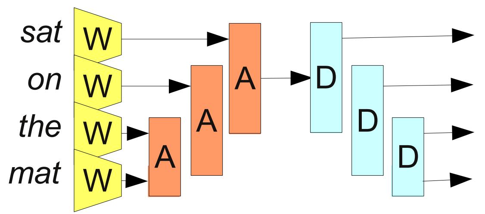

In a [previous post](../2014-07-NLP-RNNs-Representations/), I reviewed some of the deep learning results on word embeddings and NLP. Along the way, we learned about representations (and the amazing properties learned representations can have), multi-modal representations, and recursive neural networks.

That previous post discussed real results. In this post, I will indulge in speculation based on those results.

The basic idea I want to explore is that there might be an important link between deep learning, type theory and functional programming. The easiest place to see hints of this connection is in recursive neural networks.

<div class="centerimgcontainer">

<div class="caption">From [Bottou (2011)]</div>
</div>
<div class="spaceafterimg"></div>

In this perspective, neural networks correspond to functions and representations correspond to types. Functional programming is the natural language for describing a very important and challenging class of neural networks -- those with "dynamic" architectures that change in response to their input.

Let's examine a few points in more depth...

Connection 1: Recrusive Neural networks
----------------------------------------

The connection between recursive neural networks and functional programming is quite visible. Consider a few examples.

What is this if not the [map] function, applying $W$ to each word in the sentence?[^langs]

[^langs]:
    In Python, we'd write this:
    
    ```python
    R(map(W, ["cat", "sat", "song", "the", "mat"]))
    ```
    
    In Haskell, we'd write this:

    ```haskell
    R (map W ["cat", "sat", "song", "the", "mat"])
    ```


<div class="centerimgcontainer">

<div class="caption">From [Bottou (2011)]  </div>
</div>
<div class="spaceafterimg"></div>

What is this if not a [fold] and then an [unfold]?

<div class="centerimgcontainer">

<div class="caption">From [Bottou (2011)]  </div>
</div>
<div class="spaceafterimg"></div>

Finally, this network performs a [catamorphism] (a generalized fold) on a tree:

<div class="bigcenterimgcontainer">

<div class="caption">From [Bottou (2011)]  </div>
</div>
<div class="spaceafterimg"></div>

(The connection between recursive neural networks and functional programming as been noted before, of course. But I haven't seen anyone give it really serious consideration.)

[map]: http://en.wikipedia.org/wiki/Map_(higher-order_function)
[fold]: http://en.wikipedia.org/wiki/Fold_(higher-order_function)
[unfold]: http://en.wikipedia.org/wiki/Unfold_(higher-order_function)
[catamorphism]: http://en.wikipedia.org/wiki/Catamorphism

Connection 2: Neural Networks with Dynamic Architectures
---------------------------------------------------------

Recursive neural networks are one example of a broader class of neural networks, where the architecture of the network changes depending on the input. Let's refer to these as networks with dynamic architectures.

For a concrete example, consider the recursive neural networks in the previous section, which change in response to the structure and size of the sentence they receive. Another example is "conditional neural networks."[^CondNetworks] These are just two examples of networks with dynamic architectures.

[^CondNetworks]:
    Consider the problem of classifying images, like [ImageNet](http://www.image-net.org/). The images are in thousands of categories. You need to distinguish between different types of trees, different types of flowers, different types of birds, different types of dogs, and different types of fungus. Intuitively, it seems like a lot of the features you want to look for in classifying trees (is the bark smooth? are the leaves pointy?) are different from those you use to identify different kinds of fungus.
    
    The idea of a conditional neural network is that our models should have chunks that are dedicated to particular situations. It's much easier to recognize that something is a tree than to determine what kind of tree it is, so we can have a chunk of the network that only runs for trees. And if we only run a fraction of the network for every example, it is practical to have the entire model be much larger.[^MoreCond]

    For more information, see [*Deep Learning of Representations:
Looking Forward* (Bengio, 2013)](http://arxiv.org/pdf/1305.0445v2.pdf), page 8. 


Implementing neural networks with dynamic architectures is very challenging.

In fact, while the idea of a neural network is fairly simple, it's quite challenging to implement a normal neural network, because there's so many possible subtle errors and efficiency matters so much. So, we've built libraries and conceptual frameworks that make designing neural networks much easier. But our present tools really aren't able to handle neural networks with dynamic, changing architectures.

To further explore these dynamic architectures, we *need* a better framework for describing and discussing them. A few things are very striking about the problem:

(1) Neural networks are *pure* functions. They can't have side effects and they don't have state (beyond training). They map one vector space into another. Perhaps they have multiple inputs, or multiple outputs. But even recurrent neural networks, which have loops on themselves, just take a list of vectors as input and give a list of vectors as output.

(2) Neural networks can only be composed together with the representations agree. If a neural network $f$ maps a representation $A$ to a representation $B$ (let's write, $f: A \rightsquigarrow B$) and another network $g$ maps $B$ to another representation $C$ (that is, $g: B \rightsquigarrow C$), we can compose them together as $g \circ f: A \rightsquigarrow C$. On the other hand, if $g$'s input representation wasn't $B$, we could not have done that because the representations would mismatch.

I don't know about you, but that smells an awful lot like functional programming to me.


[Bottou (2011)]: http://arxiv.org/pdf/1102.1808v3.pdf


Connection 3: Multi-Modal Representations
------------------------------------------


<div class="centerimgcontainer">

</div>

----------------------

----------------------

----------------------

--------------------


Alternative definition of Deep Learning
---------------------------------------

Deep learning is a young and quickly changing field. What exactly it is depends on who you ask.

Some people will tell you that it's about recreating the Human brain. We work with neural networks inspired by deep cortical structures, perhaps. It's certainly true that the historical study of neural networks was inspired by biology. But in modern models, connections to biology seem like a pretty long stretch.

A lot of other people will give you a very pragmatic answer, that deep learning studies deep neural networks. 

Asserting a more sophisticated definition will probably only really be possible with hindsight.

But it's very plausible to me that it could be something like this: "Deep learning is the study of the optimization of compose functions." After all, what is a deep neural network except a bunch of simple, paramaterized functions composed together, and then optimized to perform some task?

Of course, that doesn't encompass recursive neural networks: "Deep learning is the study of higher order functions and optimization."

Or maybe we'll look back and see Deep Learning as a kind of continuous program synthesis. We take a functional program where certain sections are continuously paramaterized and create a program with the desired behavior by optimizing those parts.

I don't think these should be taken very seriously yet, but they provide really interesting lenses to think about deep learning through.

World Where ML is focused on representations
--------------------------------------------

Companies trying to do pattern recognition well are on board. But they're only using representations internally, for pattern recognition problems that are important for them.

Providing representations for lots of people to use on their own pattern recognition problems seems like an important and inevitable direction. Once you have a representation, we can use it for lots of problems. [etcML](http://www.etcml.com/) already moves us in this direction, making sophisticated NLP tools available for various problems. I'm confident that will happen.

But it seems like there's something very deep in representations, independent of their ability to predict things. They can help us *understand* and *connect* data. Making representations accessible seems extremely important. How can we give non-expert user access to representations?

What about exploratory data analysis? 

It seems like this is the sort of thing Wolfram should do. After all, they spent a huge amount of effort wion structure data to make Wolfram Alpha. Why haven't they moved into representation learning? What about Matlab/Octabe/Sage/etc?

Do we need open representations? Especially if we're doing massively multi-modal representations? Can people get locked into representations?

Functional Programming with Neural Networks?
--------------------------------------------

Let's consider, again, this example:

<div class="centerimgcontainer">

<div class="caption">From [Bottou (2011)]  </div>
</div>
<div class="spaceafterimg"></div>

Let's try to describe it functionally, with pseudo-Haskell code. First, let's describe the representations/types.

(Really, we're just describe the spaces the representations embed into. Word representations are embedded in $\mathbb{R}^{500}$, but they're actually some subspace with a particular shape and structure.)

```haskell
type Word        = Int
type FiveGram    = (Word, Word, Word, Word, Word)

type WordRep     = Float^500
type FiveGramRep = (WordRep, WordRep, WordRep, WordRep, WordRep)
```

Next we describe our word embedding neural network, $w: \mathrm{words} \to \mathbb{R}^{500}$. It's paramaterized by using a matrix as a lookup table ($w_\theta(n) = \theta_n$). 

`w` isn't a function, it's a neural network/paramterized function, so we do `A ~> B` instead of `A -> B` for the type.

`lookupTable` is polymorphic.

```haskell
w :: Word ~> WordRep
w = lookupTable
```

`r` is the composition of three layers. Layers are polymorphic. Neural networks form a category and we can compose them together.

```haskell
r :: FiveGramRep ~> Float
r = out . layer2 . layer1 where
    layer1 :: FiveGram   -> Float^1000
    layer1 = layer tanh
    layer2 :: Float^1000 -> Float^1000
    layer2 = layer tanh
    out :: FiveGram -> Float
    out = layer sigmoid
```

Then we can put `r` and `a` togehter, as above. We abuse notation, deconstructing the tuple even though we aren't a function and can't actually pattern match.

```haskell
f :: FiveGram ~> Float
f (w1, w2, w3, w4, w5) = r (w w1, w w2, w w3, w w4, w w5)
```

Finally, we give the property the program needs to be optimized for. This isn't at all Haskell notation anymore.

```
assert $
    map f fivegrams = valid
```


The Manifold of Words
----------------------

Hut, shanty, shack, hovel
Cabin
House, Home
Residence, Habitation, Abode, Dwelling, Domicile
Mansion, Manor, estate, 
Palace, Castle,
Lodge, château, chalet
Cottage
Apartment, Condominium
Condo, Flat

